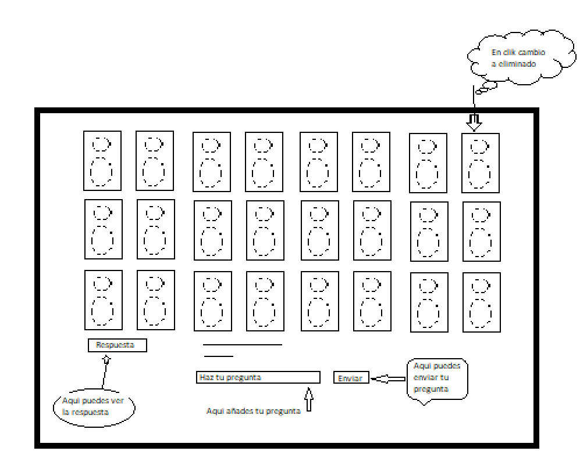
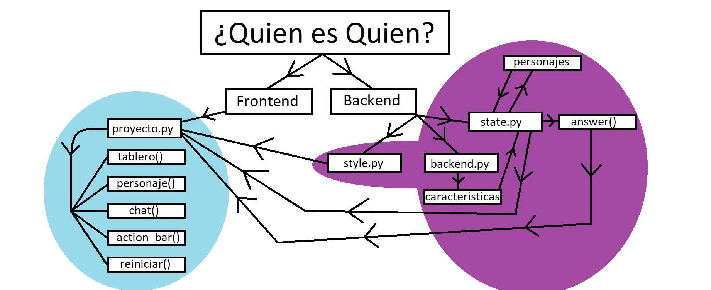
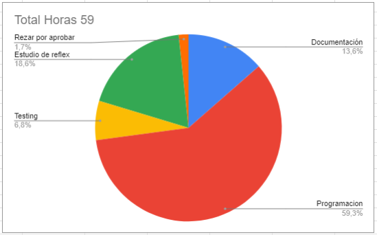
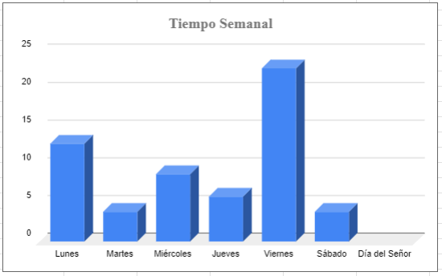
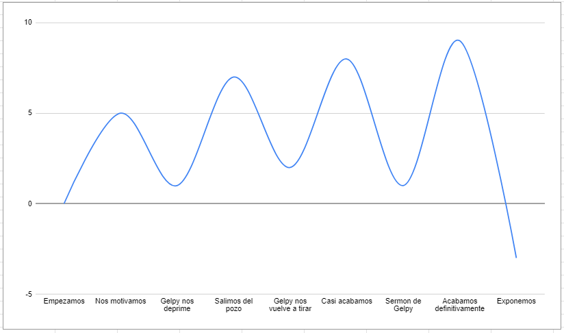

# **Proyecto_QesQ

**Tabla de contenidos**

-   [**Introducción**](#introduccion)
-   [**Manual**](#manual)
    -   [**Pre-requisitos**](#pre-requisitos)
    -   [**Instalación**](#instalación)
-   [**Metodología**](#metodologia)
-   [**Descripción técnica**](#descripción-técnica)
    -   [**Requisitos funcionales y no funcionales, NOT LIST**](#requisitos-funcionales-y-no-funcionales-not-list)
    -   [**Historias de usuario**](#historias-de-usuario)
    -   [**Diagrama de casos de uso**](diagrama-de-casos-de-uso)
    -   [**Arquitectura de la aplicación**](#arquitectura-de-la-aplicación)
-   [**Diseño**](#diseño)
    -   [**Diagrama de Componentes**](#diagrama-de-componentes)
-   [**Implementacion**](#implementación)
    -   [**Tecnologías y Herramientas utilizadas**](#tecnologías-y-herramientas-elegidas)
    -   [**Backend**](#backend)
    -   [**Frontend**](#frontend)
-   [**Análisis del tiempo invertido**](#análisis-del-tiempo-invertido)
    -   [**Graficas de tiempo**](#graficas-de-tiempo)
-   [**Cuestiones**](#cuestiones)
-   [**Conclusiones**](#conclusion)
    -   [**Posibles mejoras**](#posibles-mejoras)
    -   [**Dificultades**](#dificultades)

## **Introduccion**

 El proyecto consistia en la creación del popular juego de Quien es Quien, el cual consiste a grandes rasgos en poder adivinar el personaje de tu rival antes de que este adivine el que tu has seleccionado. En este proyecto el rival es una maquina la cual no juega y solo se limitara a responder las preguntas que tu le formules para poder adivinar el personaje que habra seleccionado aleatoriamente previamente la maquina.
    
Este proyecto llevado acabo por Javier Casal y Diego González, estudiantes de primer año de DAM (Desarrollo de Aplicaciones Multiplataforma) en el IES de TEIS con una preparación de entre dos y tres meses sobre python; llevaron acabo este proyecto basado en python con el uso de un framwork llamado "reflex" del cual no tenian conocimiento ninguno hasta la puesta en marcha de este proyecto.
    
## **Manual**

Que es lo que necesitaremos para poder jugar este juego, en primer lugar deveremos instalar las funciones necesarias q tendreis disponible en este proyecto como puede ser el propio codigo del proyecto y los recursos necesarios como pueden ser las fotos que se utilizan para los personajes, estos serian los requisitios para poder acceder al juego el cual se desenvolvera en un entorno web que nos proporcina reflex.
    
A nivel de nuestro propio equipo no necesitaremos demasiadas especificaciones ya que solo  necesitaremos el espacio suficiente para poner ejecutar el codigo y el propio reflex para que este pueda ser usado. 


### **Pre-requisitos**
-   `Git`
-   `Python3`
-   `pip3`
-   `reflex`
-   `pytest`


### **Instalación**
1- Para instalar este repositorio y acceder al juego primero tienes que crear la carpeta donde quieres guardar el repositorio, para hacer eso, sigue los siguentes comandos:
```
mkdir ./nombre_applicacion
```
```
cd ./nombre_applicacion
```

2- Al acabar el primer paso, tienes que clonar el repositorio de GitHub, con el siguente comando:
```
git clone https://github.com/diegoguntinn/Proyecto_QesQ
```

3- Al acabar el segundo paso, tienes que instalar un entorno virtual, para hacer eso, sigue los siguentes comandos:


**Versión Windows**
```
py -3 -m venv .venv
```
```
.venv\\Scripts\\activate
```

**Versión Linux**
```
python3 -m venv .venv
```
```
source .venv/bin/activate
```

4- Al acabar el tercer paso, tienes que instalar las dependencias necesarias para poder acceder a la interfaz gráfica, haciendo el siguente comando:
```
pip3 install -r requirements.txt
```

5- Cuando quieras iniciar la aplicación, solo tienes que hacer este ultimo comando: ```reflex run```.
## **Metodologia**

El orden de la elaboración del proyecto fue por las cosas que a primera vista pensarias que son las mas indispensables que deberia tener el programa para poder funcionar. Por lo que para empezar realizariamos el tablero para poder ver asi un avance donde pudieramos ver los personajes. Lo que seguimos implementando fue por la parte visible ya que sin una celda donde el usuario pudiera redactar sus cuestiones al respecto del individuo a adivinar este programa no tendria sentido. 

Una vez realizado lo minimo indispensable para jugar el juego a nivel de vista decidimos formar la logica con la cual el usuario podria interactuar usando el chat para realizar sus cuestiones y asi poder jugar. 


    
## **Descripción Técnica**
Esta aplicación la cual utiliza el Framework de Reflex, está inspirada en el juego de ¿Quién es quién?
## **Requisitos funcionales y no funcionales, NOT LIST**

## **Historias de usuario**

## **Diagrama de casos de uso**


## **Arquitectura de la aplicación**
Proyecto dividido entre las siguente carpetas:

*Frontend*
- **/proyecto** : Carpeta donde se encuentra los archivos para el funcionamiento de las páginas y su lógica.
- **/proyecto/proyecto.py** : Página en la que se jugara al ¿Quien es Quien?.
- 
*Backend*
- **/proyecto/casos_test** : Ubicación de los casos test.
- **/proyecto/state.py** : Archivo que cambia la variable question para que funcione el estado pregunta/respuesta.
- **/proyecto/backend.py** : Archivo que especifica las caracteristicas de cada personaje.
- **/proyecto/style.py** : Archivo que da estilo a los componentes.
- 
*Variado*
- **/assets** : Carpeta con las imagenes necesarias.
- **/requirements.txt** : Archivo con las dependencias.
- **/rxconfig.py** : Archivo de la configuración de Reflex.
- **/pytest.ini** : Ubicación de los marks de pytest.

## **Diseño**
### **Diagrama de Componentes**


## **Implementación**
### **Tecnologías y Herramientas Elegidas**
- [Reflex](https://reflex.dev/)
    - Framework con el cual hemos tenido que trabaja rara poder realizar el proyecto.
- [Python](https://www.python.org/)
    - [Pytest](https://docs.pytest.org/en/stable/) 
        - Librerías necesarias para realizar los casos test.

### **Backend**
La lógica está guardada en 3 archivos backend, el archivo **backend.py** y el archivo **state.py**, dentro de ellos encontraremos la logica que hace que funcione nuestra aplicacion y el archivo **/casos_test** donde estan todos los casos test.

### **Frontend**
Dentro de la carpeta **/proyecto** estan el archivo **proyecto.py**, el cual tiene la pagina entre sus lineas de codigo


## **Análisis del tiempo invertido**
### **Graficas de tiempo**
En que se uso las horas totales<br>
<br><br>
Fraccionamiento por horas en dias de la semana<br>
<br><br>
Intensidad emocional durante la duracion del proyecto<br>


## **Cuestiones**
**¿Qué herramienta de IA generativa usaste (nombre y versión)?** <br><br>
    Chatgpt 4.0 y Reflex.<br><br>
**¿Qué tipos de prompts proporcionaste?** <br><br>
    Usando este diseño repitelo para esta lisat de nombres...<br><br>
**¿Para qué usaste la herramienta?** <br><br>
    Para generar codigo reptitivo del proyecto y resolución de dudas.<br><br>
**¿Cómo has utilizado o cambiado la salida de la IA generativa?** <br><br>
    En la repetición copias y pegado y en la resolución de dudas al no ser preguntas explicitas usamos su salida para ayudarnos con nuestro problema.<br><br>
## **Conclusion**
Este proyecto nos ha servido para ver la programacion desde otro punto de vista y a afrontar nuevos retos obligandonos a ser autodidactas con un nuevo metodo de programacion con el uso de un "Framework" (Reflex). El cual nos abrio la vision del uso de python a la hora de desarrollar frontend.

En resumen, fue una experiencia didactica a la par que educativa que nos sirvio para implementar lo aprendido.
## **Posibles mejoras**
En un futuro cercano (estas navidades), ampliaremos las caracteristicas a la vez que haremos una experiencia autonoma del uso de las imagenes y ampliaremos los estilos.
## **Dificultades**
Nuesto problema principal fue la **¡¡VISTA DEL TABLERO!!** y que funcionase el estado de pregunta/respuesta.
